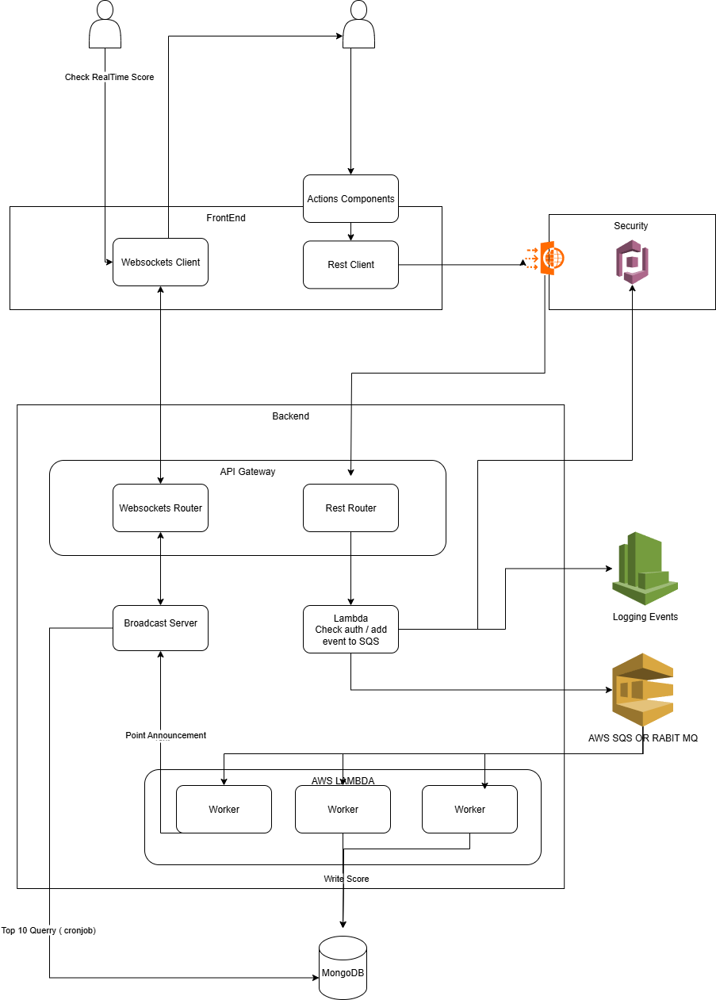
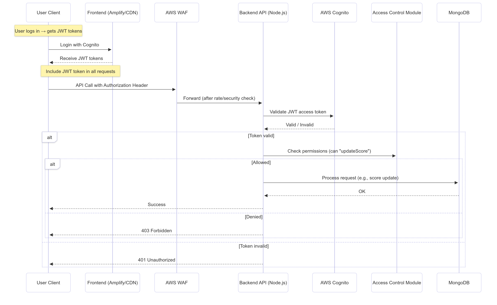
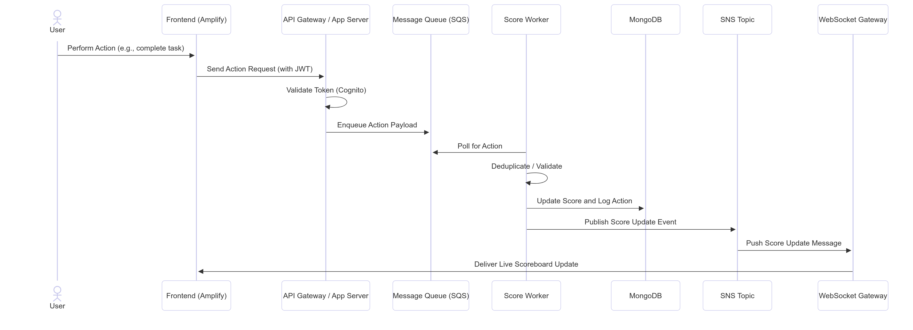
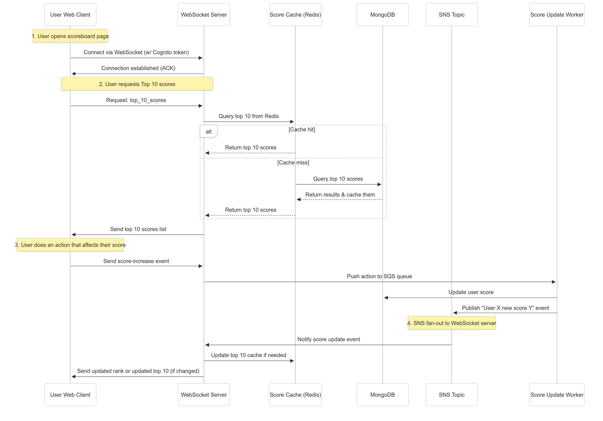

# Scoreboard System Documentation

This documentation defines a secure and scalable real-time scoreboard system leveraging AWS Amplify (Frontend), AWS Cognito (Authentication), AWS WAF (Security), AWS SQS (Queueing), WebSocket (Live updates), and MongoDB (Storage). It focuses on real-time score updates, secure API interaction, and efficient handling of unpredictable global traffic.

---

## System Objectives

1. Display the **top 10 user scores** on a global scoreboard.
2. Enable **live updates** of the scoreboard in near real-time (≤5 seconds delay).
3. Allow **users to perform actions** that increase their personal scores.
4. Prevent **malicious users** from manipulating scores.
5. Maintain **scalability and resilience** under unpredictable and high traffic.

---

##  Architecture Overview

### Diagram



---

## Component Breakdown

### Frontend (AWS Amplify + CDN)

- Serves React/Vue SPA globally via edge locations.
- Establishes WebSocket for real-time scoreboard updates.
- Uses Cognito to authenticate users and retrieve JWT tokens.

### AWS Cognito

- Handles sign-up, login, and session management.
- Issues short-lived JWT tokens.
- Integrated with backend for token validation.

### AWS WAF + API Gateway

- Protects endpoints from injection, XSS, DDoS, and abuse.
- Enforces rate limiting and IP restrictions.

### Score API Server

- Written in TypeScript with Express.js or Fastify.
- Validates JWT and enforces authorization using CASL.
- Publishes valid score update requests to AWS SQS.

### AWS SQS Queue

- Buffers score update events to handle high load.
- Supports delay tolerance (≤5s) and horizontal scaling.

### Worker Service

- Consumes messages from SQS in batches (e.g., 10 per 200ms).
- Validates actions and calculates score changes.
- Updates MongoDB in bulk (using `bulkWrite`).
- Detects change in top 10 → triggers WebSocket push.

### WebSocket Server

- Manages user connections and session tracking.
- Broadcasts new top 10 scores to all connected clients.

### MongoDB (Atlas or EC2 Cluster)

- Stores users, scores, and score history.
- Uses indexes and aggregation pipelines for efficient ranking.

---

## Score Mechanism

- Each user action (e.g., completing a game round, mission, etc.) has a predefined point value.
- Actions are validated server-side by the worker using a secure lookup table (not exposed to client).
- Each action update is logged with timestamp, action type, and resulting score.
- Total user score = Sum of valid action point contributions.


---

##  Scalability Tactics

- **Async queueing (SQS)** protects backend from sudden user spikes.
- **Worker batching** reduces DB pressure via bulk writes.
- **Horizontal scalability**: Add more worker containers as needed.
- **MongoDB Sharding**: For massive user bases, shard by userId.
- **WebSocket sharding or serverless event bus (e.g., AWS EventBridge + API Gateway)** if pushing updates at scale.
- **Top 10 caching with Redis** to prevent excessive DB reads.

---

## Authentication & Authorization Flow

### Sequence Diagram



---

## API Spec: User Auth

### POST /auth/register

Registers new user.

```json
{
  "email": "user@example.com",
  "password": "securePass123"
}
```

### POST /auth/login

Logs in a user and returns JWT.

```json
{
  "email": "user@example.com",
  "password": "securePass123"
}
```

**Response:**

```json
{
  "accessToken": "...",
  "refreshToken": "..."
}
```

---

## API Spec: Score Update

### Sequence Diagram



### POST /api/score/update

- Auth Required (JWT in Authorization header)
- Body:

```json
{
  "actionId": "game_round_win"
}
```

- Result: Enqueues score update request.
- Response:

```json
{
  "message": "Update queued"
}
```

### Worker Adds to MongoDB:

```json
{
  "userId": "abc123",
  "actionId": "game_round_win",
  "points": 25,
  "scoreAfter": 150,
  "timestamp": "2025-07-19T12:00:00Z"
}
```

---

## Real-Time WebSocket Updates



### Endpoint:

`wss://example.com/ws/leaderboard`

### Server Trigger:

- Worker compares new top 10 after DB update.
- If changed, broadcasts to all connected users:

```json
[
  { "userId": "abc", "score": 150 },
  { "userId": "xyz", "score": 140 },
  ...
]
```

### Push rank directly to user on score update via user-specific channel:

```json
{
  "userId": "abc",
  "rank": 3
}
```

---

## MongoDB Schema Design

### Collection: `users`

```json
{
  "_id": "uuid",
  "sub": "corgnito-id",
  "email": "user@example.com",
  "score": 150,
  "createdAt": timestamp
}
```

**Indexes**:

- `score` (descending) → for leaderboard
- `email` (unique) → for auth

### Collection: `action_logs`

```json
{
  "userId": "uuid",
  "actionId": "string",
  "points": Number,
  "scoreAfter": Number,
  "timestamp": timestamp
}
```
- Consider using requestId as ActionId for better query and align with Cloudwatch event.
- TTL or Archive Log after 90 days

---

## Summary Table

| Feature                      | Implementation                      |
| ---------------------------- | ----------------------------------- |
| Score submission             | HTTP + SQS Queue                    |
| Scoreboard live updates      | WebSocket Server                    |
| Authentication & Permissions | AWS Cognito + CASL + WAF            |
| Score calculation            | Worker logic + MongoDB aggregation  |
| User ranking                 | Mongo query / aggregation pipeline  |
| Performance protection       | Queueing + Batching + Indexing      |
| Real-time feedback           | WebSocket + Cached Rank Calculation |
| Data persistence             | MongoDB + Sharding Ready            |

